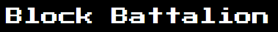

Block Battalion is the first blockchain based game to use an in-game event clock using timelock encryption. 

> This is a work in progress. Expect some bugs.

## Overview

Block battalion is a first-of-its-kind web3 game. As opposed to only leveraging a blockchain in order to immutably store ownership of in-game items or participate in the game, this game uses a blockchain (the ETF network) to **drive** the game forward. 

### Faucet

You will need to get some ETF tokens to play the game. Head to the discord faucet channel and get some tokens by sending a message `@etf-faucet-bot !drip <your address>`. If it is not working, ping @driemworks on discord.

### Game Event clock

The game event clock is the main innnovation we are attempting to showcase with this game. It provides a way for many asynchronous players to trustlessly participate in a protocol. In existing architectures, commit-reveal structures are normally used for coordinating async players. In those types or protocols, each player commits to a value, then holds onto the real value for some period of time, and later on has to submit *another* transaction to reveal the value. 

With the game event clock, we are able to relax this somewhat. Users leverage *timelock encryption* to encrypt their values, rather than broadcasting a commitment. The resulting ciphertext can be stored publicly, for example in IPFS (e.g. for a 'slow' clock) or directly in the smart contract (e.g. for a 'fast' clock). **Players are no longer responsible for storing the original message securely**.

Secondly, the game event clock is only **partially-interactive** rather than completely interactive, like the commit-reveal approach. The clock 'ticks' based on what is called a *slot schedule*, a list of [slot identities](https://etf.idealabs.network/docs/learn/overview#slot-identity) in the ETF network's consensus. At each slot in the schedule, the event clock must be manually advanced by **at least one** transaction, but this does not require interaction from all players. 

### Gameplay

Current gameplay is limited.

**Setup**

The user interface requires that the code hashes of the clock contract and the block battalion contract are available onchain. See the UI readme for more information on the pre-requisites for running it. At genesis:

1. The game is an empty 25x25 grid. 
2. Each player begins by claiming an inital cell in the grid. This is randomly selected by the UI logic, but it isn't required to be a randomly selected cell. 
3. 

## Setup

See the individual directories' readmes in order for more detailed instruction on running and testing each component of the game. In general, the game works by deploying the contracts to the ETF network and using the ui component to interface with the contract.

### ETF Network

The game works on the ETF network, which makes the timelock encryption scheme possible. You can read more about it [here](https://etf.idealabs.network).

## Contributing

Everything we do is open source and there is a lot of work to do. If interested, join our discord channel [here](https://discord.gg/4fMDbyRw7R) and say hi, or send me (Tony) an email at driemworks@idealabs.network.
